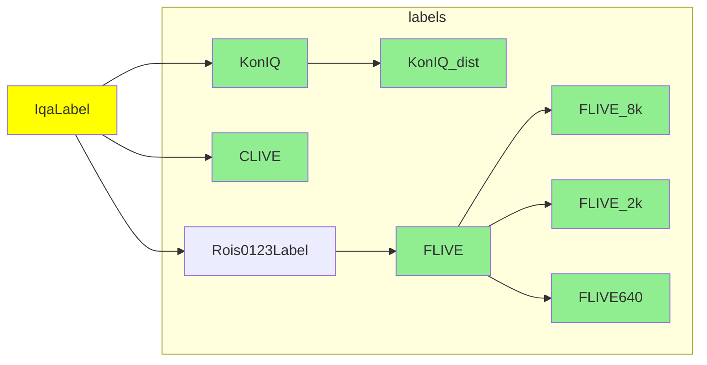

<p align="center">
|
<b><a href="#Installation">Installation</a></b>
|
<b><a href="https://arxiv.org/abs/1912.10088">ArXiv</a></b>
|
<b><a href="https://baidut.github.io/PaQ-2-PiQ/">Website</a></b>
|
<b><a href="#Setup">Setup</a></b>
|
<b><a href="https://github.com/baidut/PaQ-2-PiQ/wiki">Document</a></b>
</p>

# PaQ-2-PiQ

[](https://pypi.python.org/pypi/fastiqa)
[](https://pypi.python.org/pypi/fastiqa)
 
 

[](https://creativecommons.org/licenses/by-nc-sa/4.0/)

Code for our CVPR2020 paper ["*From Patches to Pictures (PaQ-2-PiQ): Mapping the Perceptual Space of Picture Quality*"](https://arxiv.org/abs/1912.10088)

> We packaged our source code built on FastAI inside FastIQA. **For the pure-python version, check it [this repo](https://github.com/baidut/paq2piq)**!

## Installation

* Linux system is recommended
* python 3.6 or higher
* for CPU-only usage, just install pytorch-cpu [detailed instruction coming soon]

### PyPI Install

```
pip install fastiqa
```

By default pip will install the latest `pytorch` with the latest `cudatoolkit` as well as `fastai`. If your hardware doesn't support the latest `cudatoolkit`, follow the instructions [here](https://pytorch.org/get-started/locally/), to install a `pytorch` build that fits your hardware.

### Bug Fix Install

If a bug fix was made in git and you can't wait till a new release is made, you can install the bleeding edge version with:

```
pip install git+https://github.com/baidut/PaQ-2-PiQ.git
```

### Developer Install [Recommended]

```bash
git clone https://github.com/baidut/PaQ-2-PiQ
cd PaQ-2-PiQ
pip install -r requirements.txt
```

## Demo

see [`demo.ipynb`](demo.ipynb)

## Get Started with FastIQA :rocket: 


For brief examples, see the [examples](https://github.com/fastai/fastai/tree/master/examples) folder; 

```python
%matplotlib inline
from fastiqa.basics import *

# setup an experiment on gpu 0
e = IqaExp('test_different_models', gpu=0)

# pick a dataset: CLIVE data, Im2MOS format: input image, output MOS
data = Im2MOS(CLIVE, batch_size=16)

# add learners 
for model in [models.resnet18, models.resnet34, models.resnet50]:
	e += iqa_cnn_learner(data, model)
	
# start training all models
e.fit(10)

# validate on other databases
e.valid(on=[Im2MOS(KonIQ), Im2MOS(FLIVE)])
```

The sections about advanced materials will be marked with *

### Prepare labels

First we need to prepare images and labels. All label classes are extended from `IqaLabel`, which stores all default configurations. By default, we assume all databases are put under `!data` folder. To pack your database:

1. make a short name for your database, e.g. `PLIVE`

2. put images under `!data\PLIVE\images` (or other places)

3. put label files `!data\PLIVE\labels.csv`, the label should contain a column `name` for filename and `mos` for scores

4. define your database label class:

   ```python
   class PLIVE(IqaLabel):
       path = '!data/PLIVE'
       csv_labels = 'labels.csv'
       
       fn_col = 'name'
       label_cols = 'mos', # don't omit the comma here
       folder = 'images'
       valid_pct = 0.2  # how many percent of data for validation
   ```

5. define subset if you have any, now you can extend from `PLIVE` to get all its default settings :

   ```python
   class PLIVE_256x256(PLIVE):
       folder = '256x256'
   ```

   For `PLIVE_256x256`, it will load images from `256x256` instead of `images` folder. 

6. You are all set! 

    Some IQA databases have been packed and ready to use:



### Advanced Label Format*

* `ImageRoI` contains the image size information so that we could do RoIPool on the whole image area and get image score prediction
* `Rois0123` contains the roi information of patch0 (image), patch1, patch2, patch3

### Analyze labels

Check out `csv/vis.py` you will find some useful visualization functions. Simply put 

`Vis(PLIVE).` and press `tab`, a smart IDE will pull out those functions :)


### Browse Images

You could use `Browser(PLIVE)` to go over images and labels:


### Bunch labels to Datasets

How you gonna load the data for training/testing the model:

* `Im2MOS`  input images, output MOSs
* `RandCrop2MOS`
* `Rois0123`

Or you could define your own way of bunching data:

```python
class MyBunch(IqaDataBunch):
    def get_data(self):
        # write your code here
        # ...
        return data # return a fastai data object
```

Please follow [fastai's tutorial](https://docs.fast.ai/tutorial.data.html) to prepare your database.

Finally, you could also use the way existing model bunches it:

```python
# use the way how NIMA processes the data to prepare CLIVE database
data = NIMA.bunch(CLIVE)
```

After bunching it:

```python
db= MyBunch(PLIVE)

# check out information (e.g. # images in train/val split)
print(db.data)

# show a batch
db.show_batch()
```

Also check out [other fastai functions](https://docs.fast.ai/basic_data.html#DataBunch.show_batch) that you can call :)

### Prepare your models

you could use pretrained CNN models: `model = models.resnet18`

* [fastai models](https://docs.fast.ai/vision.models.html) ([undocumented models](https://github.com/fastai/fastai/tree/master/fastai/vision/models))
* [Pretrained models for Pytorch](https://github.com/Cadene/pretrained-models.pytorch)

or define your own model (in exactly  [Pytorch](https://pytorch.org/) way but extend it from `IqaModel`):

```python
class BodyHeadModel(IqaModel):
    def __init__(self):
        super().__init__()
        self.__name__ = self.__class__.__name__
        self.body = create_body(models.resnet18)
        
        nf = num_features_model(self.body) * 2
        self.head = create_head(nf, 1)
        
    def forward(self, img):
        feat = self.body(img)
        pred = self.head(feat)
        return pred
        
    @staticmethod
    def split_on(m):
        return [[m.body], [m.head]]
    
    @staticmethod
    def bunch(self, label, **kwargs):
        return Im2MOS(label, **kwargs)
```

Here, `split_on` function split the model into two groups and use smaller learning rate for pretrained CNN backbone and bigger learning rate for head layers. `bunch` function tells how this model bunch the labels.

### Learner

Now you can train your model easily just as in Fastai :) 

One thing to note, `models.resnet18` and `models.resnet18()` is different, the former one is just a n architecture that should go to `iqa_cnn_learner` to create actual model object.

```python
# iqa_cnn_learner is a sub class of cnn_learner in Fastai but with useful functins
data = Im2MOS(CLIVE)
model = models.resnet18

learn = iqa_cnn_learner(data, model)
learn.fit(10)
```

While the latter one is an model object that should go to `IqaLearner`:

```python
# iqa_cnn_learner is just like IqaLearner in Fastai but with useful functins
data = Im2MOS(KonIQ)
model = models.resnet18()

learn = IqaLearner(data, model)
learn.fit(10)
```

By default, the best model and training history will be stored under the dataset folder, see`!data\PLIVE\models\bestmodel.pth` and ``!data\PLIVE\history.csv`

### Setup Experiments

`IqaExp` is a bunch of learners (in a dictionary form) 

Directory structure would be:

* data:
  * CLIVE
  * KonIQ
* experiment_name
  * model_name: *one model, one folder, easy to manage*
    * train@data_name
      * models
        * bestmodel.pth: parameters of current best model
      * history.csv: model training history
      * valid@data_name.csv: validation outputs
* fastiqa: the library
* your_code.py
* your_notebook.ipynb

## Citation

If you use this code for your research, please cite our papers.

```
@article{ying2019patches,
  title={From Patches to Pictures (PaQ-2-PiQ): Mapping the Perceptual Space of Picture Quality},
  author={Ying, Zhenqi
  ang and Niu, Haoran and Gupta, Praful and Mahajan, Dhruv and Ghadiyaram, Deepti and Bovik, Alan},
  journal={arXiv preprint arXiv:1912.10088},
  year={2019}
}
```

## Acknowledgments

Our code is built on [fast.ai](https://www.fast.ai/)


<p align="right"><a href="#top">:arrow_up: back to top</a></p>
